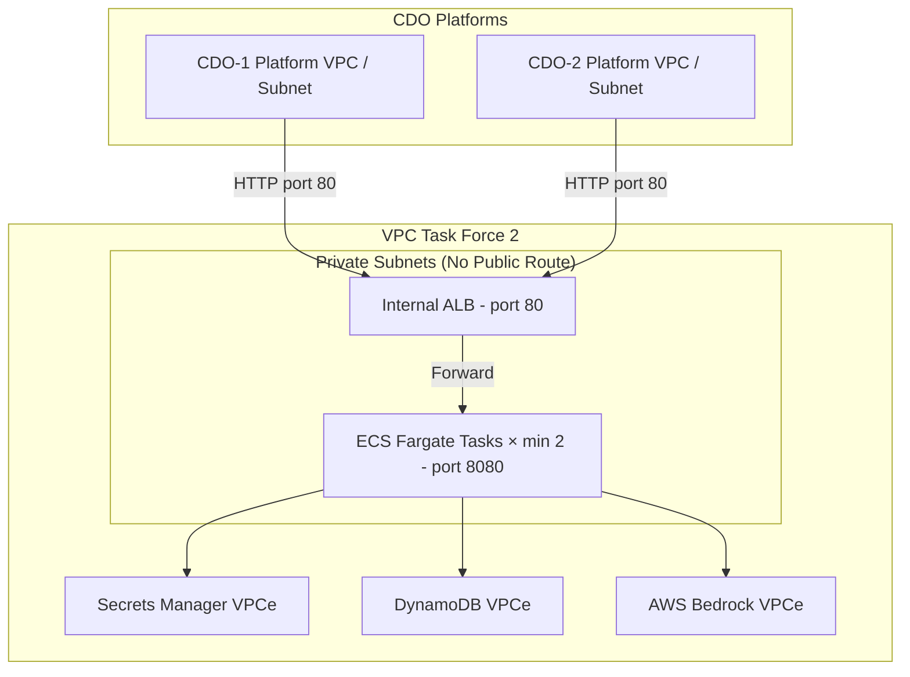

# Deployment Contract - Task Force 2 (FinOps Watch)

<!-- Owner: Nhóm AI
     Signed by: AI Lead + CDO Leads × 2-3 + Reviewer panel
     Date signed: 2026-06-25 (W11 T5)
     🔒 FREEZE - no change without formal change request -->

## Mục đích

Định nghĩa **cấu hình triển khai (deployment spec)** của AI Engine trên hạ tầng AWS. CDO platform sẽ dựa trên tài liệu này để thiết lập mạng, cấp phát tài nguyên compute và phân quyền bảo mật phù hợp để tích hợp.

## Key principle

**Nhóm AI chỉ host AI engine DUY NHẤT một lần trên một cụm chung (Shared cluster) của Task Force 2.** 
Cả 2 nhóm CDO sẽ cùng trỏ về một endpoint nội bộ chung, AI engine tự động cách ly context và phân luồng dữ liệu dựa trên `X-Tenant-Id` của request.

---

## Compute

| Aspect | Configuration |
|---|---|
| **Target** | ECS Fargate task |
| **Cluster** | `tf-2-aiops-cluster` |
| **Service name** | `ai-engine` |
| **Image source** | Amazon ECR (Private Repo) |
| **CPU per task** | 1024 (1 vCPU) - *Nâng cấu hình để chạy các thư viện toán học/mảng numpy* |
| **Memory per task**| 2048 MB - *Đảm bảo an toàn không bị OOM khi xử lý batch 12 squads* |
| **Port** | 8080 (TCP) |

## Scaling

| Aspect | Value |
|---|---|
| **Replicas** | min 2, max 4 (đủ dự phòng lỗi, không cần scale lên 10 vì chạy batch 24h) |
| **Autoscale trigger 1** | Target CPU Utilization 80% |
| **Autoscale trigger 2** | Target Memory Utilization 80% |
| **Scale-up cooldown** | 60 giây |
| **Scale-down cooldown**| 300 giây |

## Secrets & Credentials

| Secret name | Source |
|---|---|
| `AWS_BEDROCK_ROLE` | IAM Task Execution Role (Gán trực tiếp cho ECS Task, không dùng long-lived access key) |
| `AWS_REGION` | Biến môi trường động `${AWS_REGION}` |

---

## Networking

| Aspect | Configuration |
|---|---|
| **Subnet type** | Private subnets (isolated, không có internet route trực tiếp ngoại trừ qua VPC Endpoints) |
| **ALB** | Internal ALB (không public-facing, chỉ truy cập nội bộ trong VPC) |
| **Security group** | `tf-2-ai-engine-sg` |
| **Ingress rules** | Chỉ cho phép lưu lượng trên cổng 8080 từ Security Groups của các CDO platforms trong Task Force 2. |
| **Egress rules** | Chỉ cho phép kết nối đến AWS Bedrock (VPC Endpoint) và AWS Secrets Manager/DynamoDB (VPC Endpoints). |
| **DNS** | Bản ghi Route 53 Private Hosted Zone: `ai-engine.tf-2.internal` trỏ vào Internal ALB. |

## Deployment topology diagram

*Diagram caption: Mô hình mạng cô lập trong VPC của Task Force 2. AI Engine chạy trong subnet bảo mật, chỉ nhận request từ CDO platform thông qua Internal ALB.*

---

## Rollout & Rollback strategy

### Rollout: Canary

| Step | Traffic | Interval |
|---|---|---|
| 1 | 10% | 5 phút |
| 2 | 50% | 5 phút |
| 3 | 100% | - |

**Điều kiện hủy (Abort Criteria)**: Tự động rollback ngay lập tức nếu:
- Tỉ lệ lỗi API (Error rate) > 1% trong quá trình canary.
- Latency P99 > 500 ms.

### Rollback
- **Phương thức chính**: GitOps rollback thông qua PR/ArgoCD để hạ version Docker Image trên ECS Service.
- **Thời gian RTO**: < 60 giây.

---

## Health check

| Field | Value |
|---|---|
| **Path** | `/health` |
| **Port** | 8080 |
| **Interval** | 30 giây |
| **Healthy threshold** | 2 lần trả về HTTP 200 liên tiếp |
| **Unhealthy threshold**| 3 lần trả về non-200 liên tiếp |

---

## Observability

- **Logs**: Xuất dạng JSON log ra AWS CloudWatch Logs (retention 14 ngày).
- **Metrics**: Tích hợp AWS CloudWatch Metrics để theo dõi số lượng request, CPU, RAM và số lượng gọi API Bedrock.
- **Traces**: Tích hợp AWS X-Ray thông qua OpenTelemetry SDK.
