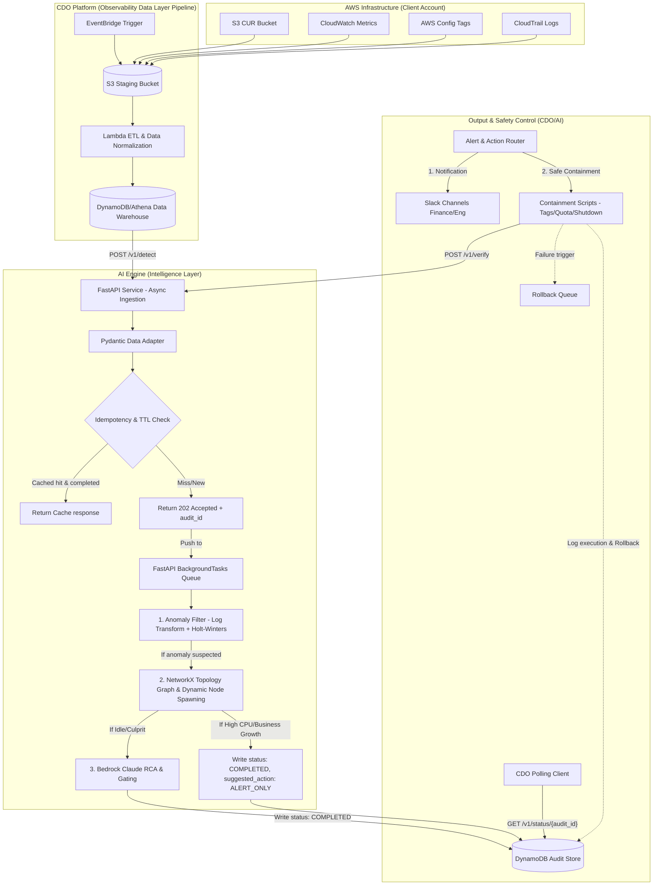

# Solution Design - FinOps Watch (Task Force 2)

<!-- Doc owner: Nhóm AI
     Status: Updated (W11 T6 Pack #1)
     Word count: ~1600 từ -->

## 1. High-level architecture

Kiến trúc hệ thống FinOps Watch kết hợp giữa công nghệ thu thập dữ liệu tự động của CDO, mô hình kết hợp (Hybrid) giữa thống kê và LLM của nhóm AI để phát hiện và ngăn chặn bất thường chi phí, hoạt động theo mô hình Async Polling Pattern.

*Diagram caption: Luồng dữ liệu chạy định kỳ (scheduled batch) mỗi 24 giờ. CDO tiếp nhận response 202 Accepted và thực hiện Polling kiểm tra trạng thái của Task từ DynamoDB Audit Store. AI Engine sử dụng bộ lọc Holt-Winters, NetworkX Graph RCA tự động phân tách nút con cho chi phí dùng chung (Dynamic Node Spawning), và Bedrock Claude giải trình.*

---

## 2. Component breakdown

| Component | Responsibility | Tech choice | Why |
|---|---|---|---|
| **Data Layer Pipeline** | Thu thập dữ liệu từ S3, CloudWatch, CloudTrail, Config; xử lý dữ liệu khuyết thiếu và nạp vào kho dữ liệu. | EventBridge + S3 + AWS Lambda | Phù hợp với tính chất batch 24h, rẻ và dễ vận hành. |
| **Pydantic Data Adapter** | Nhận, kiểm tra tính hợp lệ và tự động chuyển đổi đơn vị dữ liệu đầu vào (ví dụ: `idle_minutes_continuous` sang `idle_hours_continuous`). | Pydantic v2 | Bảo vệ AI Engine chống lại các thay đổi ngẫu nhiên về schema đầu vào của CDO. |
| **Idempotency Engine** | Thực hiện tra cứu nhanh trong DynamoDB với TTL 24 giờ. Kiểm tra định dạng khóa composite bắt buộc: `[tenant_id]_[billing_period]_[batch_sequence]`. | DynamoDB SDK (Boto3) | Tránh chạy lại thuật toán và gọi API Bedrock gây tốn kém chi phí vô ích, chống chồng đè cache. |
| **Statistical Filter** | Thực hiện phép biến đổi Log Transform để chuẩn hóa phân phối dữ liệu chi phí bị lệch (Skewed Cost), sau đó chạy Holt-Winters để phát hiện bất thường. | Numpy / Scipy | Tối ưu hóa tính toán số học trên RAM, triệt tiêu False Positive ngày Thứ 2. |
| **Topology-aware Graph RCA & Dynamic Node Spawning** | Đồ thị hóa quan hệ tài nguyên bằng `networkx`. Nhận diện nhãn fallback (`service-level-aggregate`) và tự động phân tách (Dynamic Node Spawning) dựa trên `fallback_context` mạng (ví dụ: `service-level-aggregate:vpc-0abcdef`) để tránh mù quáng mô hình. | NetworkX Python Library | Phân biệt chính xác giữa **Business Growth** và **Culprit** (chi phí cao + idle -> đề xuất `SCHEDULE_SHUTDOWN`). |
| **Reasoning Engine** | Giải thích nguyên nhân bất thường bằng ngôn ngữ tài chính Finance-friendly và đề xuất hành động. | AWS Bedrock Claude 3.5 Haiku | Claude 3.5 Haiku có tốc độ xử lý nhanh, chi phí cực kỳ rẻ, khả năng đọc hiểu log tốt và hỗ trợ xuất dữ liệu dạng JSON Schema chính xác. Ngưỡng chấm điểm tự tin được cấu hình động theo từng Tenant. |
| **Audit & Tenant-Isolated Error Budget Store**| Lưu trữ lịch sử phát hiện, hành động ngăn chặn và theo dõi số lần rollback của từng squad độc lập để tự động khóa auto-containment của riêng squad đó nếu vượt hạn mức 1%. | Amazon DynamoDB | Đảm bảo tính nhất quán dữ liệu, phục vụ cơ chế Tenant-Isolated Error Budget Gate. |

---

## 3. Data flow & Latency Budget (Async Polling Pattern)

Để giữ vững mục tiêu kiến trúc và an toàn hệ thống, loại bỏ nguy cơ sập nghẽn mạch kết nối (Connection Pool Exhaustion) khi Bedrock xử lý mất nhiều thời gian, AI Engine loại bỏ mô hình Request-Response đồng bộ và triển khai cơ chế **Async Polling Pattern**:

1.  **POST /v1/detect (Đồng bộ nhanh)**: AI Engine tiếp nhận request, validate định dạng idempotency key composite, đẩy mảng tín hiệu vào hàng đợi xử lý ngầm (FastAPI BackgroundTasks). Hệ thống lập tức trả về `202 Accepted` kèm `audit_id` trong vòng **< 50ms**.
2.  **Xử lý ngầm (Background Processing)**: AI Engine chạy ngầm thuật toán Holt-Winters, phân tích đồ thị NetworkX (phân tách nút động nếu gặp fallback). Nếu có bất thường, gọi tiếp Bedrock (P99 < 10 giây). Kết quả ghi trực tiếp vào DynamoDB Audit Store với khóa `audit_id` và trạng thái `COMPLETED` hoặc `FAILED`.
3.  **CDO Polling (GET /v1/status/{audit_id})**: CDO gọi polling sau mỗi 2-3 giây. Mỗi lượt truy vấn DynamoDB mất **< 10ms**, hoàn toàn không gây nghẽn mạch API Gateway hay timeout.

### Cơ chế Fallback an toàn (Failure Handling)
Nếu AWS Bedrock bị lỗi mạng hoặc quá tải (Provider Outage), AI Engine sẽ tự động kích hoạt **Circuit Breaker** tầng ứng dụng, ghi nhận trực tiếp kết quả chạy Rule-based từ NetworkX Graph RCA với `fallback_active: true` vào Audit Store, giúp CDO poll được kết quả và duy trì SLA 99.5% hoạt động.

---

## 4. Alternatives considered (KEY)
*Xem chi tiết trong tài liệu quyết định kiến trúc [`05_adrs.md`](05_adrs.md).*

---

## 5. Risk + mitigation

| Risk | Likelihood | Impact | Mitigation |
|---|---|---|---|
| **Ảo tưởng LLM (Hallucination)** | Thấp | Cao | Áp dụng cấu trúc đầu ra nghiêm ngặt (Strict JSON schema) kết hợp kiểm định độ tin cậy (confidence score < 0.6 -> Refuse auto-action). |
| **Vượt ngưỡng giới hạn gọi API (Throttling)** | Trung bình | Trung bình | Triển khai cơ chế Retry-with-exponential-backoff và thiết lập fallback về cơ chế cảnh báo dựa trên quy tắc thống kê (rule-based) khi Bedrock bị lỗi. |
| **Auto-action ảnh hưởng môi trường Production** | Thấp | Cực kỳ cao | Thiết lập cấu hình bảo vệ cứng (hard-coded whitelist) trong code AI Engine: kiểm tra tag `FinOps_Bypass = True` hoặc `Environment = Prod` để ép buộc kết quả hành động là `ALERT_ONLY`. |
| **AI can thiệp sai gây gián đoạn hệ thống (FP)** | Thấp | Cao | Áp dụng cơ chế **Error Budget Gating**: tự động khóa tính năng tự động khóa/tắt máy ảo của AI trên toàn hệ thống nếu tỷ lệ rollback lỗi vượt quá 1% trong tháng. |

---

## Related documents

*   [`01_requirements.md`](01_requirements.md) - Đặc tả yêu cầu từ CFO
*   [`03_ai_engine_spec.md`](03_ai_engine_spec.md) - Cấu hình prompts và mô hình quản trị AI
*   [`../contracts/ai-api-contract.md`](../contracts/ai-api-contract.md) - API endpoints
*   [`../contracts/telemetry-contract.md`](../contracts/telemetry-contract.md) - Telemetry signals
*   [`05_adrs.md`](05_adrs.md) - Ghi nhận các quyết định kiến trúc cụ thể
