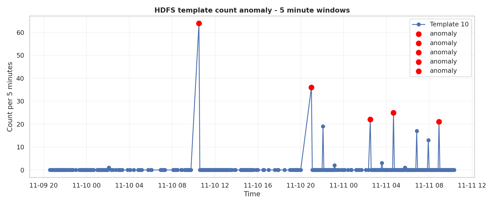
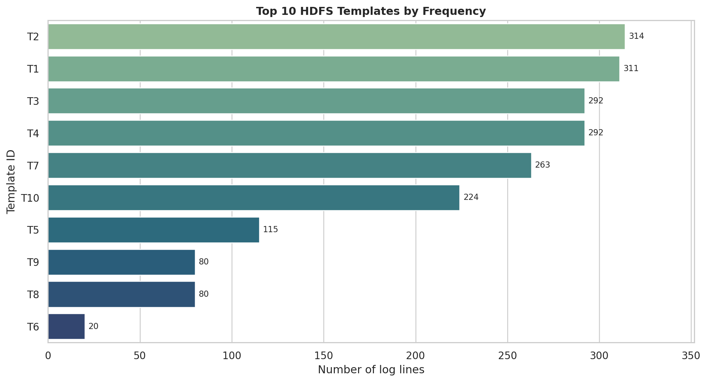
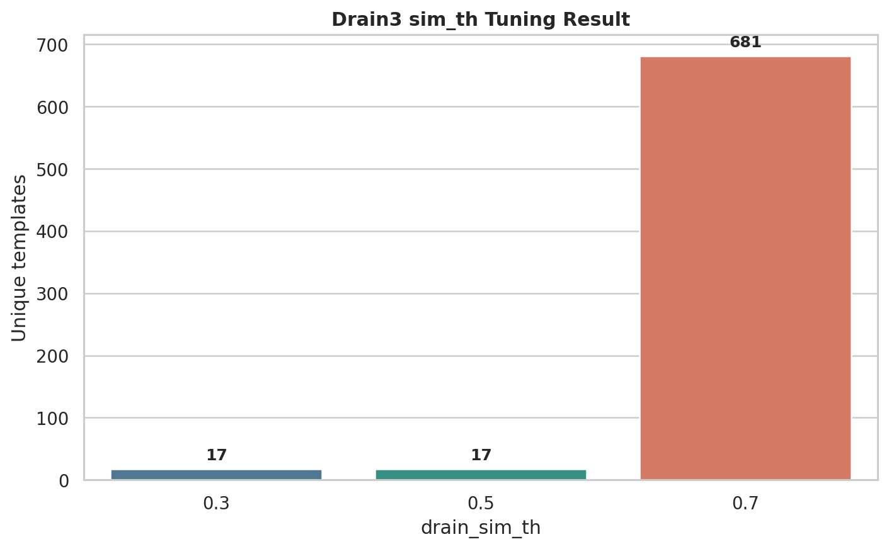
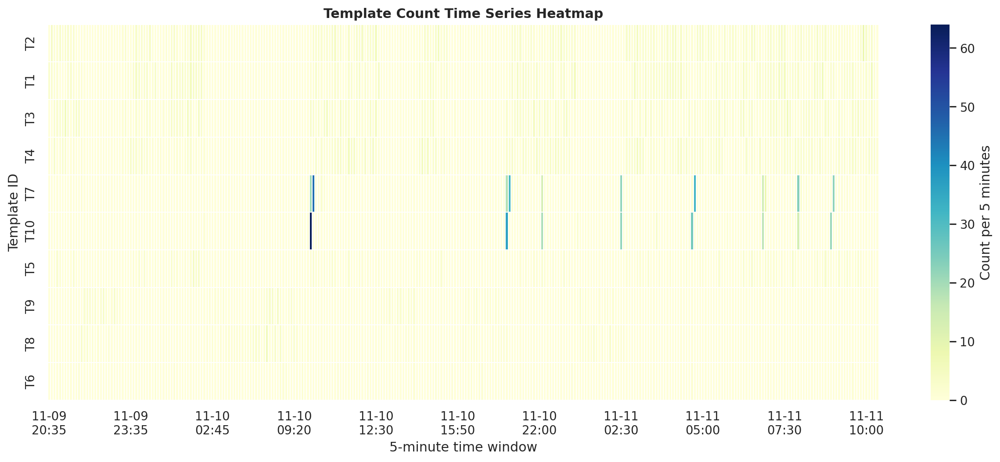
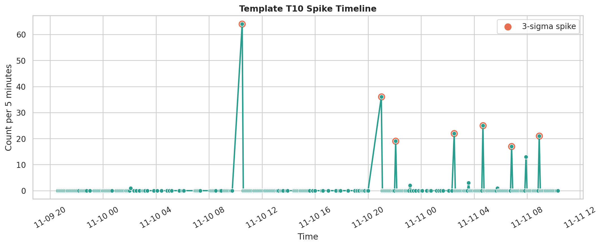
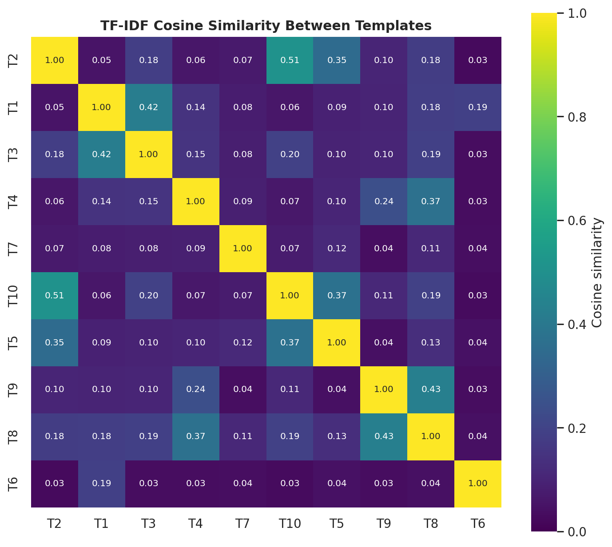

# SUBMIT - W1 Day 2: Log Mining, Drain3 Parsing và Anomaly Detection

## 1. Dataset sử dụng: HDFS

Dataset sử dụng là HDFS sample từ Loghub, file nằm tại:

```text
data/HDFS_2k.log
```

File template tham khảo có sẵn:

```text
data/HDFS_2k.log_templates.csv
```

## 2. Tổng số dòng log

Tổng số dòng log: **2000**

Số template unique khi dùng `sim_th = 0.5`: **17**

## 3. Kết quả tuning Drain3

| sim_th | Số template unique | Nhận xét |
|---:|---:|---|
| 0.3 | 17 | Gộp mạnh hơn, ít template hơn |
| 0.5 | 17 | Cân bằng nhất |
| 0.7 | 681 | Tách quá nhiều, tạo rất nhiều template nhỏ |

## 4. Giá trị sim_th tốt nhất

Giá trị được chọn: **sim_th = 0.5**.

Lý do: `sim_th = 0.3` có xu hướng gộp nhiều log khác nhau vào cùng một template, còn `sim_th = 0.7` tách quá mạnh và tạo ra tới **681 templates**. Với dataset HDFS sample này, `sim_th = 0.5` là lựa chọn cân bằng hơn, vừa giữ được cấu trúc log chính vừa tránh tạo quá nhiều template nhỏ.

## 5. Top-10 templates

| template_id | count | template |
|---:|---:|---|
| 2 | 314 | `dfs.FSNamesystem: BLOCK* NameSystem.addStoredBlock: blockMap updated: <*> is added to <*> size <*>` |
| 1 | 311 | `dfs.DataNode$PacketResponder: PacketResponder <*> for block <*> terminating` |
| 3 | 292 | `dfs.DataNode$PacketResponder: Received block <*> of size <*> from <*>` |
| 4 | 292 | `dfs.DataNode$DataXceiver: Receiving block <*> src: <*> dest: <*>` |
| 7 | 263 | `dfs.FSDataset: Deleting block <*> file <*>` |
| 10 | 224 | `dfs.FSNamesystem: BLOCK* NameSystem.delete: <*> is added to invalidSet of <*>` |
| 5 | 115 | `dfs.FSNamesystem: BLOCK* NameSystem.allocateBlock: <*> <*>` |
| 9 | 80 | `dfs.DataNode$DataXceiver: <*> exception while serving <*> to <*>` |
| 8 | 80 | `dfs.DataNode$DataXceiver: <*> Served block <*> to <*>` |
| 6 | 20 | `dfs.DataBlockScanner: Verification succeeded for <*>` |

## 6. Kết quả phát hiện anomaly theo template count

Anomaly có ý nghĩa nhất sau khi bỏ qua các spike chỉ xuất hiện 1 lần:

```text
Template: T10
Thời điểm: 2008-11-10 10:30:00
Count trong 5 phút: 64
Mean 5 phút: 0.73
Z-score: 12.66
Rule: 3-sigma
```

Template bị spike:

```text
dfs.FSNamesystem: BLOCK* NameSystem.delete: <*> is added to invalidSet of <*>
```

Giải thích: template T10 bình thường xuất hiện rất ít, trung bình khoảng **0.73 lần / 5 phút**, nhưng tại thời điểm spike tăng lên **64 lần / 5 phút**. Đây là dấu hiệu bất thường rõ ràng theo rule 3-sigma.

Plot anomaly được lưu tại:

```text
plots/template_count_anomaly.png
```

Ảnh anomaly đã được dán sẵn:




## 7. Kết quả new template detection

Log lạ được inject:

```text
CRITICAL Payment database corrupted at node x999 with code 777
```

Kết quả:

```text
New template detected: True
Template: CRITICAL Payment database corrupted at <*> with code <*>
```

Kết luận: Drain3 phát hiện đây là template mới vì nội dung log khác hoàn toàn các template HDFS đã có.

## 8. Kết quả TF-IDF similarity

Các cặp template giống nhau nhất:

- similarity=0.509: `dfs.FSNamesystem: BLOCK* NameSystem.addStoredBlock: blockMap updated: <*> is added to <*> size <*>` <-> `dfs.FSNamesystem: BLOCK* NameSystem.delete: <*> is added to invalidSet of <*>`
- similarity=0.427: `dfs.DataNode$DataXceiver: <*> exception while serving <*> to <*>` <-> `dfs.DataNode$DataXceiver: <*> Served block <*> to <*>`
- similarity=0.420: `dfs.DataNode$PacketResponder: PacketResponder <*> for block <*> terminating` <-> `dfs.DataNode$PacketResponder: Received block <*> of size <*> from <*>`
- similarity=0.375: `dfs.FSNamesystem: BLOCK* NameSystem.delete: <*> is added to invalidSet of <*>` <-> `dfs.FSNamesystem: BLOCK* NameSystem.allocateBlock: <*> <*>`
- similarity=0.368: `dfs.DataNode$DataXceiver: Receiving block <*> src: <*> dest: <*>` <-> `dfs.DataNode$DataXceiver: <*> Served block <*> to <*>`

Nhận xét: các template liên quan đến block lifecycle của HDFS như add, delete, receive, serve block có độ tương đồng cao hơn các template khác.

## 9. Visualizations trong notebook

Notebook có các biểu đồ vẽ trực tiếp bằng `seaborn` và `matplotlib`. Khi chạy notebook, các biểu đồ vừa hiển thị trong notebook vừa được lưu thêm vào folder `plots/`.

Các file plot đã lưu:

- `plots/top_templates_bar.png` - Top-10 template frequency bar chart
- `plots/drain_tuning_comparison.png` - Drain3 `sim_th` tuning comparison
- `plots/template_timeseries_heatmap.png` - Template count heatmap theo window 5 phút
- `plots/template_spike_timeline.png` - 3-sigma anomaly timeline
- `plots/tfidf_similarity_heatmap.png` - TF-IDF cosine similarity heatmap
- `plots/template_count_anomaly.png` - Plot anomaly chính của assignment

### Các biểu đồ đã dán sẵn

Top-10 template frequency:



Drain3 tuning comparison:



Template count heatmap:



Anomaly timeline:



TF-IDF similarity heatmap:




## 10. Kết quả chạy mini log analyzer

Lệnh chạy:

```powershell
python log_analyzer.py data/HDFS_2k.log
```

Output chính:

```text
Total log lines: 2000
Unique templates: 17
Top-5 templates printed successfully
Template spikes in the last 1 hour: None detected
New templates in the last 1 hour: None detected
```

Nhận xét: script chạy đúng yêu cầu Phase 4. Trong 1 giờ cuối của dataset không có spike hoặc template mới đủ điều kiện, nhưng khi phân tích toàn bộ time series trong notebook thì phát hiện spike T10 ở thời điểm `2008-11-10 10:30:00`.

### Chỗ dán screenshot terminal


## 11. Reflection

Drain3 parse dataset HDFS khá tốt sau khi bỏ timestamp, pid và log level khỏi phần matching. Các template quan trọng nhất đều liên quan đến vòng đời block của HDFS như `addStoredBlock`, `PacketResponder`, `Received block`, `Deleting block` và `invalidSet`.

Metric cho biết một chỉ số thay đổi theo thời gian, còn log giúp giải thích hành vi nào trong hệ thống đang thay đổi. Với bài này, template count anomaly detection giúp phát hiện thời điểm một loại log tăng đột biến, từ đó có thể khoanh vùng nguyên nhân nhanh hơn.

Điểm mạnh của bài là parse log, tuning Drain3, đếm template, detect spike, TF-IDF similarity và new template detection đều chạy được. Điểm hạn chế là dataset `HDFS_2k.log` chỉ có 2000 dòng, nên kết quả anomaly chỉ mang tính minh họa học tập, chưa đại diện cho production scale.
