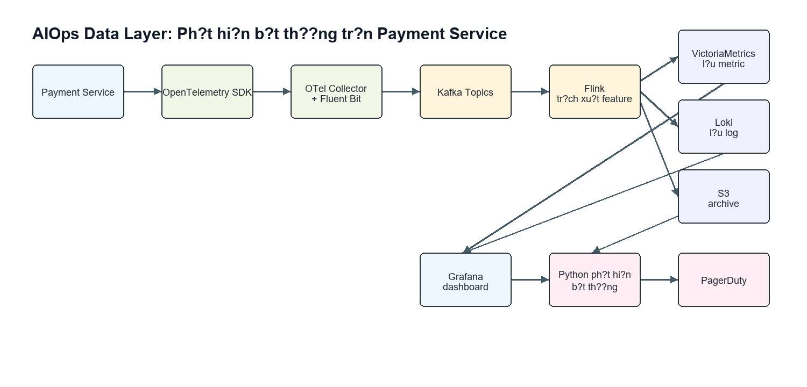

# Bài nộp Day 3: AIOps Data Layer

## 1. Sơ đồ kiến trúc



Tình huống sử dụng: phát hiện bất thường trên `payment-service`.

Luồng xử lý: Payment Service -> OpenTelemetry SDK -> OTel Collector/Fluent Bit -> Kafka -> Flink -> VictoriaMetrics/Loki/S3 -> Grafana/Python anomaly detector -> PagerDuty.

Kiến trúc này mô phỏng data layer production cho observability/AIOps. Service phát ra metric, log và trace; pipeline phía sau gom dữ liệu, buffer bằng Kafka, xử lý stream bằng Flink, lưu metric/log, rồi feed feature cho anomaly detector.

## 2. Vì sao chọn kiến trúc này?

Kafka được chọn vì telemetry của payment service là dữ liệu critical. Nếu Loki, VictoriaMetrics hoặc processor bị chậm/down, Kafka giúp buffer dữ liệu thay vì làm mất tín hiệu quan trọng. Replay capability cũng giúp post-mortem và retraining anomaly detector sau incident.

Flink được chọn thay vì batch Spark vì anomaly detection cần rolling feature gần realtime, thường trong detection window vài giây đến vài chục giây. Với bài này, `pipeline.py` là bản mock local của logic đó: đọc stream giả lập và tạo rolling mean/rate of change.

VictoriaMetrics được chọn vì Prometheus-compatible nhưng phù hợp hơn cho retention/compression ở workload lớn. Loki được chọn thay vì Elasticsearch để giảm indexing/storage cost cho log-heavy workload. S3 đóng vai cold storage để giữ dữ liệu dài hạn phục vụ compliance, replay và training lại ML model.

Trace correlation giúp root-cause analysis tốt hơn metric-only monitoring: metric phát hiện latency spike, trace chỉ ra bottleneck ở service/dependency nào, log xác nhận lỗi cụ thể như DB timeout.

## 3. Ước tính chi phí

```text
Chạy: uv run python cost_model.py
```

| Quy mô | Số service | Log/ngày | Metric EPS | Lưu trữ | Tính toán | Mạng | Tổng self-host | Tổng Datadog |
| --- | --- | --- | --- | --- | --- | --- | --- | --- |
| Small | 10 | 50 GB | 100,000 | $235.98 | $475.00 | $50.74 | $761.72 | $904.92 |
| Medium | 100 | 500 GB | 1,000,000 | $2,359.80 | $4,750.00 | $507.36 | $7,617.16 | $9,049.20 |
| Large | 1000 | 5120 GB | 10,000,000 | $23,760.00 | $47,632.00 | $5,145.60 | $76,537.60 | $91,392.00 |

Ở Small scale, Kafka và Flink có thể hơi nặng nếu team chỉ cần monitoring cơ bản. Ở Large scale, direct push có rủi ro làm quá tải storage hoặc mất dữ liệu khi downstream chậm, nên kiến trúc có queue/buffer và tiered storage hợp lý hơn.

## 4. Tóm tắt ADR

ADR-001 chọn Kafka thay vì direct push cho lớp vận chuyển telemetry. Kafka làm tăng chi phí broker và thêm khoảng 100-300 ms độ trễ, nhưng đổi lại có durable buffering, replay, cô lập consumer và scale an toàn hơn cho mức 1M-10M metric events/giây. Direct push đơn giản và rẻ hơn cho hệ thống rất nhỏ, nhưng có rủi ro overload hoặc mất dữ liệu khi storage/stream processor bị suy giảm.

## 5. Nhận xét

Với startup Series A có khoảng 50 service, tôi sẽ khuyến nghị buy trước, ví dụ dùng Datadog hoặc Grafana Cloud. Team cần time-to-value nhanh, alerting đáng tin cậy và ít hệ thống phải tự vận hành. Chạy Kafka, Flink, VictoriaMetrics, Loki và retention trên S3 một cách đúng đắn cần platform maturity, on-call runbook, capacity planning và failure testing.

Chiến lược tốt hơn là bắt đầu bằng SaaS cho observability, nhưng dùng OpenTelemetry ngay từ đầu để tránh vendor lock-in. Khi log/metric volume tăng đủ lớn, team có thể chuyển dần các workload đắt sang self-host hoặc hybrid stack. Ở mức 50 service, sự tập trung của engineering team thường đáng giá hơn phần tiết kiệm chi phí hạ tầng.
