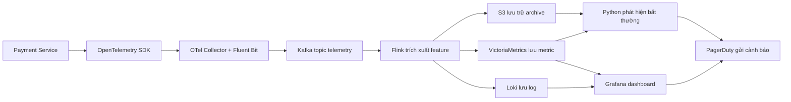

# Kiến trúc AIOps: Phát hiện bất thường trên Payment Service

Tình huống sử dụng: phát hiện bất thường về độ trễ và tỷ lệ lỗi trên `payment-service`, tương quan với log, rồi thông báo cho đội on-call trước khi sự cố ảnh hưởng nghiêm trọng đến luồng thanh toán.

| Lớp | Công cụ chọn | Lý do |
| --- | --- | --- |
| Service | Payment Service | Phát ra metric về độ trễ, throughput, lỗi và trace của luồng checkout. |
| Thu thập | OpenTelemetry SDK + OTel Collector + Fluent Bit | Thu thập metric/trace theo chuẩn trung lập với vendor, kèm log shipping nhẹ. |
| Vận chuyển | Kafka | Buffer bền vững, hỗ trợ replay, chia partition theo service và cô lập backpressure. |
| Xử lý | Flink | Tính rolling window có trạng thái cho feature bất thường và enrich stream. |
| Lưu metric | VictoriaMetrics | Lưu time-series hiệu quả cho dữ liệu có cardinality cao. |
| Lưu log | Loki | Index log theo label với chi phí hợp lý để tương quan theo service. |
| Lưu trữ dài hạn | S3 | Lưu retention dài hạn và dữ liệu replay/training với chi phí thấp. |
| Truy vấn | Grafana | Dashboard thống nhất cho metric/log và trực quan hóa alert. |
| ML | Python anomaly detector | Đọc feature stream và phát hiện spike về độ trễ/tỷ lệ lỗi. |
| Alerting | PagerDuty | Điều hướng incident payment nghiêm trọng đến kỹ sư trực on-call. |
