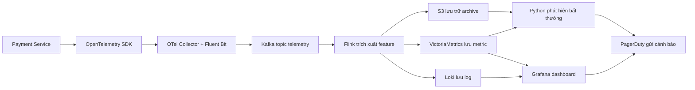

# Kiến trúc AIOps: Phát hiện bất thường trên Payment Service

Tình huống sử dụng: phát hiện bất thường về độ trễ và tỷ lệ lỗi trên `payment-service`, tương quan với log/trace, rồi thông báo cho đội on-call trước khi sự cố ảnh hưởng nghiêm trọng đến luồng thanh toán.



## Luồng xử lý E2E

`payment-service` phát ra metric, log và trace. OpenTelemetry SDK instrument service để tạo telemetry theo chuẩn mở. OTel Collector và Fluent Bit gom dữ liệu, chuẩn hóa metadata như `service`, `env`, `trace_id`, rồi đẩy vào Kafka. Flink đọc stream từ Kafka để tính rolling feature gần realtime. Metric được lưu ở VictoriaMetrics, log được lưu ở Loki, dữ liệu dài hạn được archive vào S3. Grafana dùng metric/log để dashboard và alert, còn Python anomaly detector đọc feature để phát hiện spike bất thường và gửi PagerDuty.

Workflow 3 pillars khi incident xảy ra:

```text
latency spike trên metric
-> trace xác định bottleneck ở payment-service hoặc dependency
-> log chỉ ra lỗi cụ thể, ví dụ DB timeout
-> Grafana/PagerDuty cảnh báo cho on-call
```

## Lựa chọn công cụ và lý do

| Lớp | Công cụ chọn | Vai trò | Vì sao chọn |
| --- | --- | --- | --- |
| Service | Payment Service | Phát ra latency, throughput, error rate, log và trace checkout. | Payment là critical path, nên telemetry phải đủ chi tiết để phát hiện lỗi sớm. |
| Thu thập | OpenTelemetry SDK + OTel Collector + Fluent Bit | Thu thập metric/trace/log và chuẩn hóa metadata. | OpenTelemetry giúp tránh vendor lock-in; Collector tách logic thu thập khỏi application code. |
| Vận chuyển | Kafka | Buffer stream, partition theo service, replay dữ liệu. | Payment telemetry là dữ liệu quan trọng. Replay giúp post-mortem và retraining anomaly detector khi downstream outage xảy ra. |
| Xử lý | Flink | Tính rolling mean/rate of change gần realtime. | Chọn Flink thay vì batch Spark vì anomaly detection cần rolling feature trong vài giây, không phải batch theo giờ. |
| Lưu metric | VictoriaMetrics | Lưu time-series metric cho query và alert. | Prometheus-compatible nhưng retention/compression tốt hơn Prometheus standalone ở workload lớn. |
| Lưu log | Loki | Lưu log theo label để tương quan theo service/trace. | Chọn Loki thay vì Elasticsearch để giảm indexing/storage cost cho log-heavy workload. |
| Lưu trữ dài hạn | S3 | Lưu archive phục vụ compliance, replay và training data. | S3 rẻ cho cold storage và phù hợp giữ dữ liệu lâu dài. |
| Truy vấn | Grafana | Dashboard, alert visualization và drill-down. | Grafana kết nối tốt với VictoriaMetrics/Loki và quen thuộc với đội vận hành. |
| ML | Python anomaly detector | Đọc feature stream để phát hiện spike latency/error. | Python thuận tiện cho thử nghiệm rule/model anomaly detection và retraining. |
| Alerting | PagerDuty | Gửi incident tới on-call. | Payment incident cần escalation rõ ràng, có ownership và audit trail. |

## Retention và storage tier

| Tier dữ liệu | Công cụ | Retention đề xuất | Mục đích |
| --- | --- | --- | --- |
| Hot | VictoriaMetrics/Loki | 7-30 ngày | Dashboard, alerting và debug incident gần đây. |
| Warm | VictoriaMetrics downsample hoặc Loki retention dài hơn | 30-90 ngày | Trend analysis, capacity planning, post-mortem. |
| Cold | S3 archive | 6-12 tháng hoặc theo compliance | Replay, retraining ML model và audit. |

## Trade-off theo scale

Ở Small scale, Kafka có thể là overkill vì direct push đơn giản hơn, latency thấp hơn và ít chi phí vận hành hơn. Ở Medium/Large scale, direct push dễ làm quá tải storage/processor khi traffic tăng hoặc downstream bị chậm. Kafka trở nên hợp lý hơn vì nó cô lập backpressure, giữ dữ liệu tạm thời và cho phép replay khi cần điều tra sự cố.
