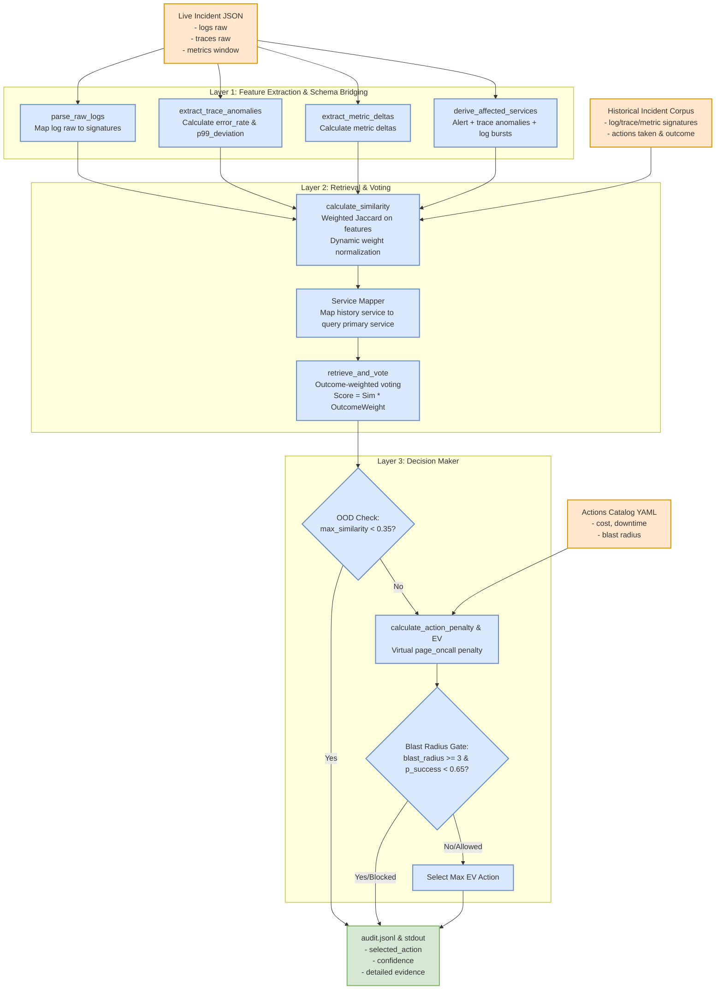

# Lab — Evidence-Driven Remediation Engine

This project implements an evidence-driven remediation engine that analyzes microservice incidents using logs, traces, and metrics, retrieves similar historical incidents, and selects the optimal action using Expected Value (EV) decision theory.

## System Architecture

Dưới đây là sơ đồ kiến trúc đường ống xử lý (Pipeline) của hệ thống gồm 3 Layer chính và các luồng dữ liệu di chuyển giữa các cấu phần:



## Setup & How to Run

1. **Install Dependencies**:
   Ensure you have Python 3.12 installed. Install the required YAML library:
   ```bash
   pip install pyyaml
   ```

2. **Run the Engine on an Incident**:
   Run the engine CLI using the `decide` command:
   ```bash
   python engine.py decide --incident eval/E01.json \
                           --history incidents_history.json \
                           --actions actions.yaml
   ```

3. **Verify Decisions**:
   You can run the engine on all 8 evaluation incidents and run the auto-grader to verify predictions:
   ```bash
   # In PowerShell (Windows):
   if (Test-Path audit.jsonl) { Remove-Item audit.jsonl }
   1..8 | ForEach-Object { $i = "{0:D2}" -f $_; python engine.py decide --incident eval/E$i.json }
   python grade.py --audit audit.jsonl --expected eval/expected.json
   ```

Expected Output: `Correct: 8/8` with an auto-rubric estimate of `85/85` points.
